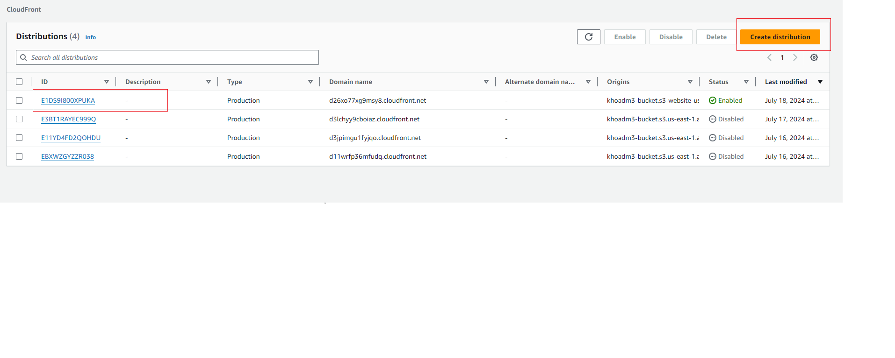
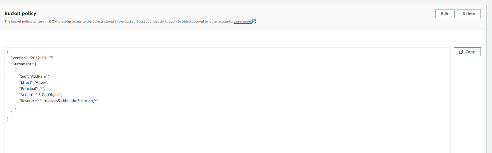
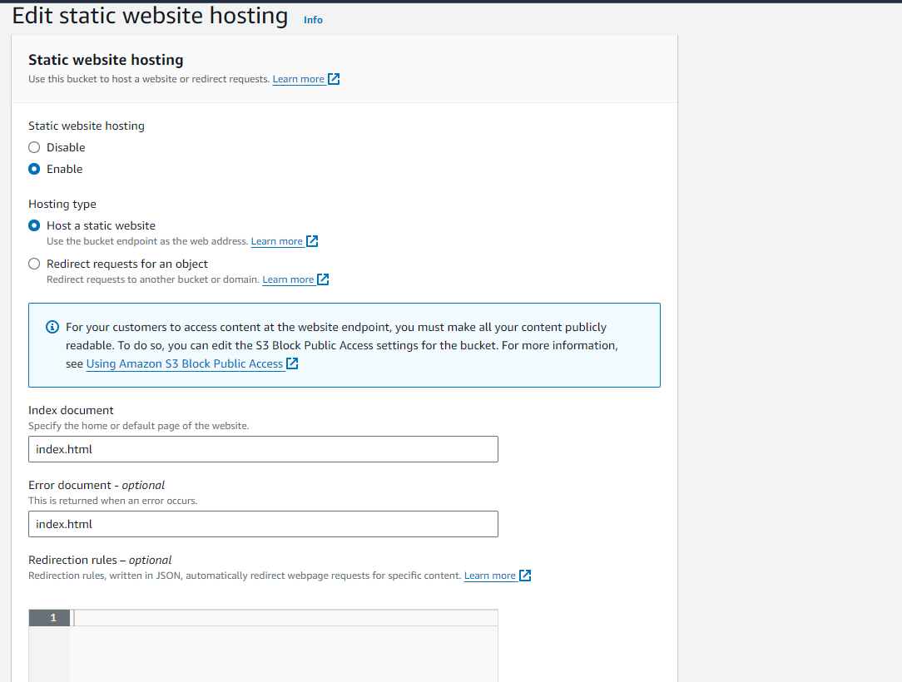
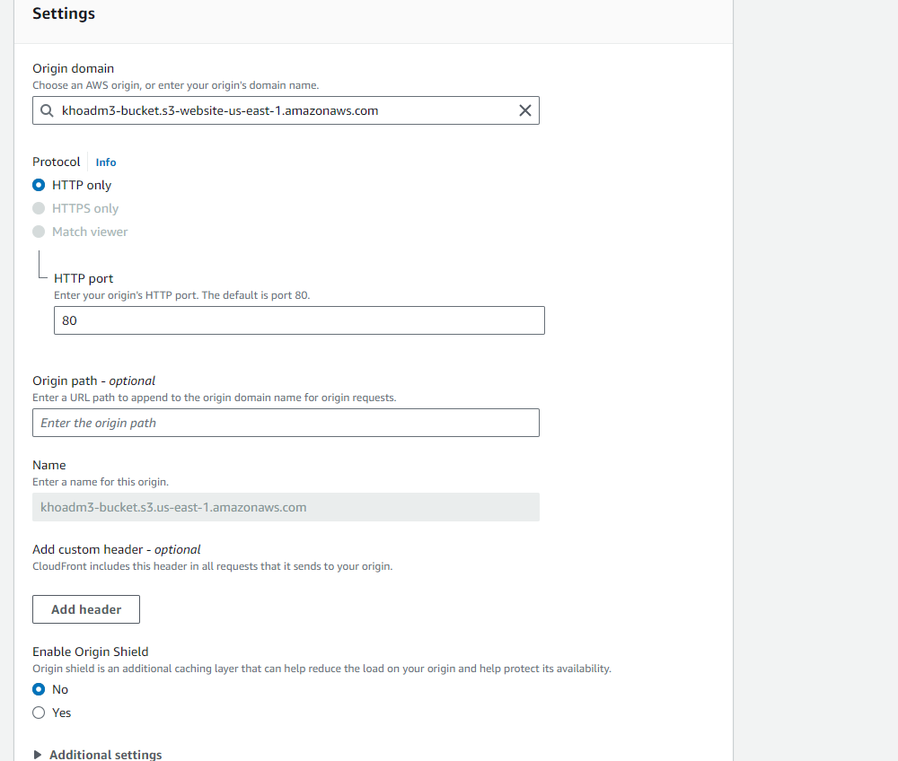
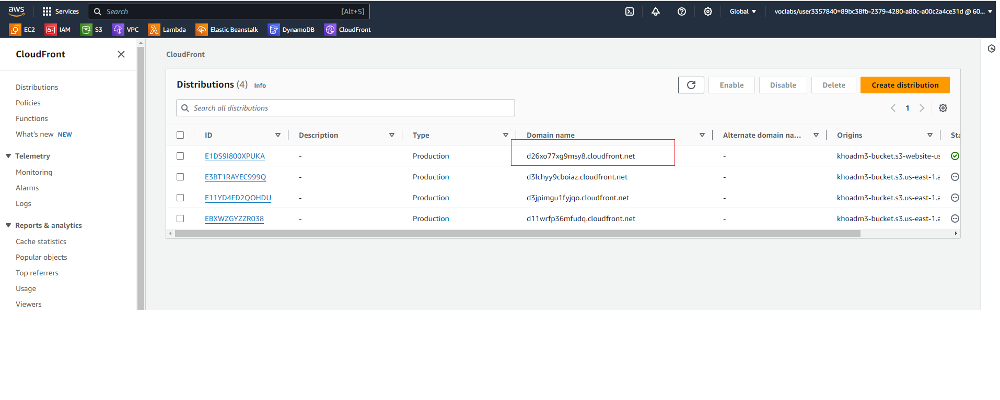

# Deploy Static Website on AWS

In this project, you will deploy a static website to AWS using S3, CloudFront, and IAM.

The files included are: 

index.html - The Index document for the website.
/img - The background image file for the website.
/vendor - Bootssrap CSS framework, Font, and JavaScript libraries needed for the website to function.
/css - CSS files for the website.

## Step 1: Create S3 Bucket
I created S3 bucket name: khoadm3-bucket

 
## Step 2: Upload project to S3 bucket

Choose button Upload -> choose upload file to upload file index.html and README. Choose upload folder to upload folder css, img and vendor
-> Result after upload
 

## Step 3:Config security bucket S3:
Choose tab Permission -> Edit bucket policy
-> Result after edit:
 

## Step 4:Config edit static web hosting
enable Static website hosting and enter index document and error document.
 

## Step 5: Create CloudFront:
Search CloudFront -> Create distribution
 
## Step 6: Config CloudFront
Setting origin and watting deploy

## Step 7: Access Website in Browser
CloudFront -> copy domain name of distribution configed -> paste in browser:

 

=> result:
 

